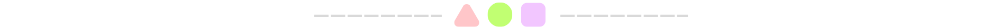
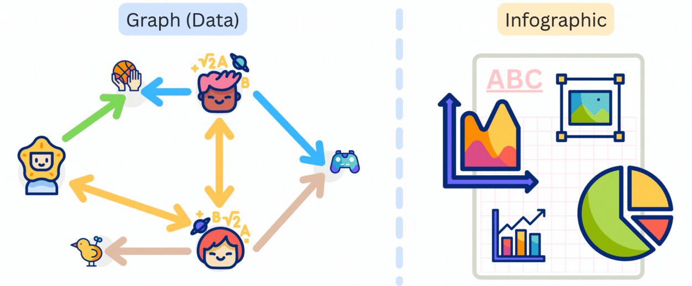
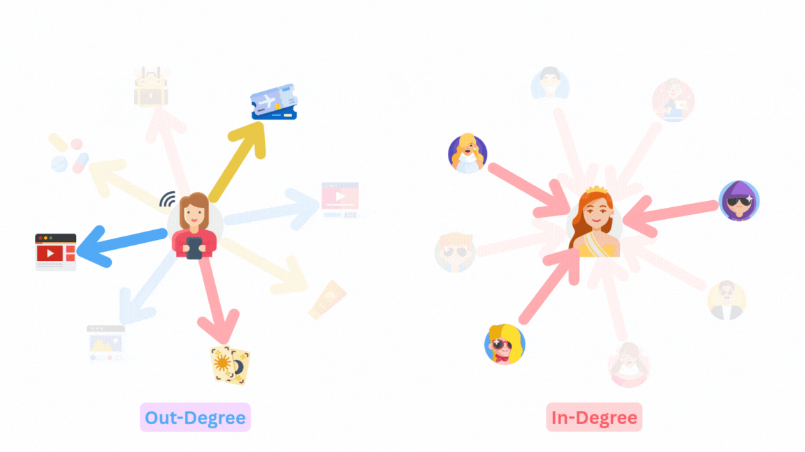
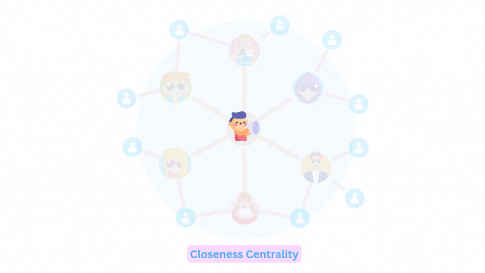
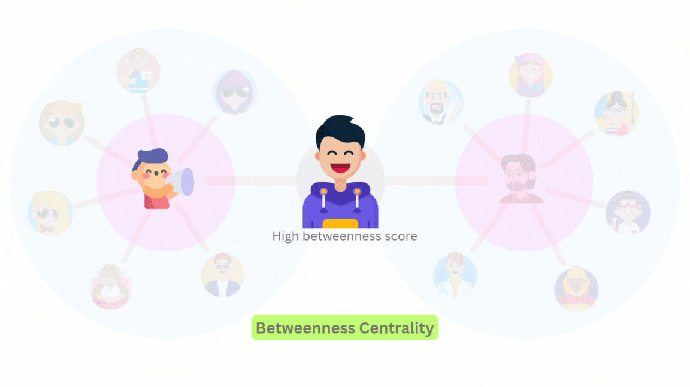
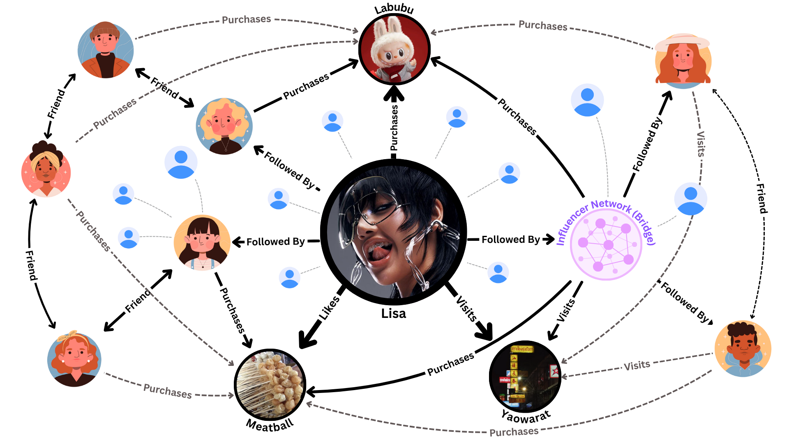
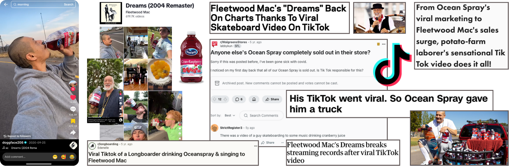
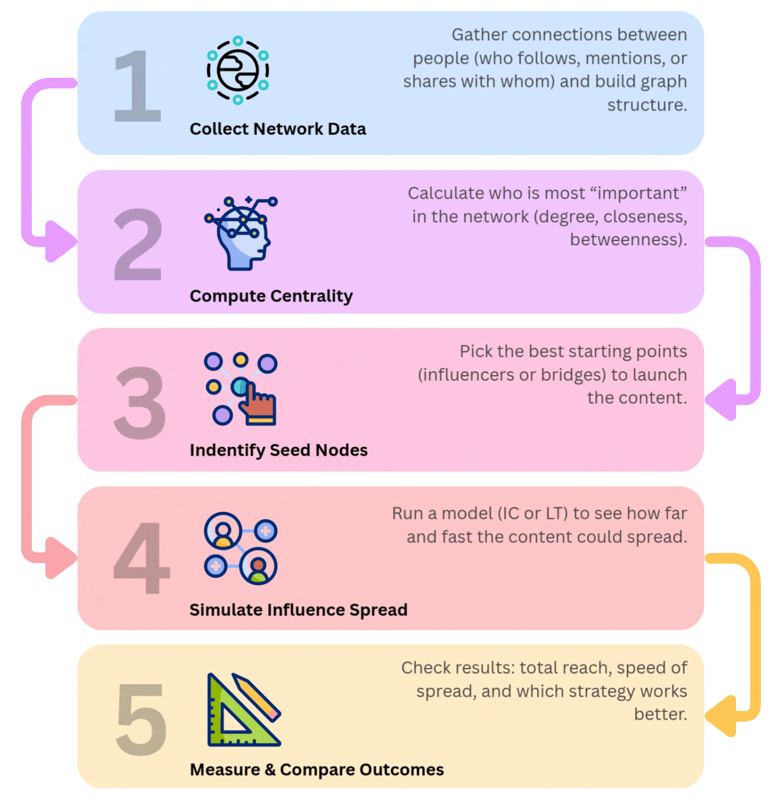
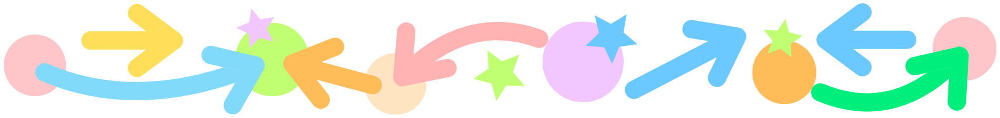

# Science of Going Viral with Graph Theory   

![[banner-gif-medium] Going Viral](images/banner-gif-medium-crop-going-viral.gif)    

# Introduction   
ทำไมบางคอนเทนต์ถึงกลายเป็นไวรัลในชั่วข้ามคืน ขณะที่บางคอนเทนต์กลับถูกกลืนหายไปในความเงียบ?   
คำตอบอาจไม่ได้อยู่แค่ในความคิดสร้างสรรค์หรือการโฆษณาเพียงอย่างเดียว แต่ซ่อนอยู่ใน **โครงสร้างเครือข่ายของผู้คนและการเชื่อมโยงระหว่างกัน**   
ในยุคที่โซเชียลมีเดียทำให้เสียงเล็กๆ สามารถขยายไปไกลกว่าที่เคยเป็น ปรากฏการณ์ **viral spread** จึงไม่ใช่เรื่องบังเอิญ แต่เป็นผลลัพธ์จาก **กลไกของเครือข่าย (networks)** ที่ทำให้ “อิทธิพล” ถูกส่งต่อจากคนหนึ่งไปสู่อีกคนหนึ่งเป็นวงกว้าง   
ในบทความนี้ เราจะพาไปสำรวจ **ศาสตร์เบื้องหลังการเป็นไวรัล (science of going viral)** ผ่านมุมมองของ **Graph Theory** เครื่องมือทางคณิตศาสตร์ที่ช่วยให้เราเข้าใจว่า   
- ใครคือคนสำคัญในเครือข่ายที่จุดกระแสได้   
- ทำไมบางกระแสถึงแพร่กระจายอย่างรวดเร็ว   
- และธุรกิจหรือแบรนด์สามารถใช้ประโยชน์จากโครงสร้างเครือข่ายเหล่านี้อย่างไร   
   
ปรากฏการณ์อย่าง **Lisa Effect** ที่พลิกของกินท้องถิ่นให้กลายเป็นกระแสระดับประเทศ หรือคลิป TikTok ของ Nathan Apodaca ที่เปลี่ยนชีวิตคนธรรมดาให้กลายเป็น influencer ชั่วข้ามคืน ต่างสะท้อนให้เห็นว่า **การเข้าใจเครือข่ายและการแพร่กระจายอิทธิพลไม่ใช่แค่เรื่องวิชาการ แต่เป็นทักษะที่สร้างคุณค่าทางธุรกิจได้จริง**    
บทความนี้ตั้งใจอธิบายแนวคิดเหล่านี้ในแบบที่เข้าใจง่าย **โดยไม่ลงลึกเชิงเทคนิค** เพื่อให้ผู้อ่านจากหลากหลายสายงานเห็นภาพและนำไปต่อยอดได้ สำหรับผู้ที่สนใจรายละเอียดเชิงลึก จะมีลิงก์เพิ่มเติมให้ศึกษาได้เอง :'>   

# From Viral Phenomena to Graph Theory   
เบื้องหลังของกระแสไวรัลต่างๆ มักถูกมองว่าเป็นแค่เรื่องของโชคหรือจังหวะเวลา แต่ถ้ามองลึกลงไปจะเห็นว่ากระแสเหล่านี้มี **"โครงข่ายความสัมพันธ์"** ที่ซับซ้อนซ่อนอยู่ การมองไวรัลเป็นเพียง "คลิปดังชั่วข้ามคืน" อาจจะเป็นแค่ยอดภูเขาน้ำแข็ง ทำให้เราพลาดโอกาสในการเข้าใจกลไกที่แท้จริงของการแพร่กระจายที่ซ่อนอยู่เบื้องหลังเหล่านี้   
**ทฤษฎีกราฟ (Graph Theory)** คือกุญแจที่ไขความลับนี้ โดยเปลี่ยนเครือข่ายผู้คนที่มองไม่เห็น ให้กลายเป็นโมเดลทางคณิตศาสตร์ที่จับต้องได้ มันช่วยให้เราไม่ใช่แค่ "เห็น" ว่าใครเชื่อมโยงกับใคร แต่ยัง "เข้าใจ" ว่าอิทธิพลเดินทางจากจุดหนึ่งไปอีกจุดหนึ่งได้อย่างไร   

# Graph Theory 101: แปลงโลกของเครือข่ายให้อยู่ในมือ   
ในแบบพื้นฐานที่สุด กราฟ (Graph) ประกอบด้วย:   
- **Node (โหนด / จุด):** ตัวแทนของคน สินค้า หรือคอนเทนต์ต่างๆ   
- **Edge (เส้นเชื่อม):** ความสัมพันธ์ หรือการปฏิสัมพันธ์ที่เกิดขึ้นระหว่างโหนด เช่น การติดตาม การแชร์ การรีวิว   
- **Network (เครือข่าย):** โหนด และเส้นเชื่อมทั้งหมดที่รวมกันเป็นโครงสร้างขนาดใหญ่

ลองจินตนาการว่าตัวเราคือหนึ่งโหนด และเพื่อนใน Facebook หรือผู้ติดตามใน TikTok ก็คือเส้นเชื่อมที่โยงไปยังโหนดอื่นๆ ยิ่งเรามีเส้นเชื่อมมากเท่าไร โอกาสที่เราจะ “ส่งต่อ” อะไรบางอย่างก็ยิ่งสูงขึ้นเท่านั้น

![[medium-transparent] 101-graph-theory](images/medium-transparent-101-graph-theory.gif)    

 --- 

## **กราฟ (ในโลกของข้อมูล) กับอินโฟกราฟิกต่างกันยังไงนะ?**   
กราฟที่เรากำลังกล่าวถึงคือ **เครื่องมือ** สำหรับวิเคราะห์ความสัมพันธ์ของสิ่งต่างๆ เพื่อหาคำตอบที่เราอาจจะมองไม่เห็นด้วยตาเปล่า โดยมี**โหนด**แทนสิ่งของ ผู้คน หรือข้อมูลต่างๆ และมี**เส้นความสัมพันธ์**ที่เชื่อมจุดเหล่านั้นเข้าด้วยกัน โดยจะแตกต่างจากอินโฟกราฟิก (Infographic) ที่เป็นการย่อยข้อมูลเยอะๆให้เหลือใจความสำคัญ แล้วใช้รูปภาพ สีสัน กราฟรูปแบบต่างๆ มาตกแต่งให้เห็นภาพ และน่าสนใจ

    

    
# Centrality Measures: เครื่องมือวิเคราะห์ว่าใครมีอิทธิพลจริง   
### 1. Degree Centrality: จุดรวมสายสัมพันธ์   
- **แนวคิด:** วัดจำนวนการเชื่อมโยงโดยตรงของโหนดกับโหนดอื่น ๆ ซึ่งสามารถแยกได้เป็น   
    - **In-Degree:** จำนวนเส้นที่วิ่งเข้าหาโหนด บ่งบอกว่ามีคนสนใจ/ติดตามเราเยอะแค่ไหน เช่น เซเลบริตี้ที่มีผู้ติดตามเยอะ   
    - **Out-Degree:** จำนวนเส้นที่วิ่งออกจากโหนด บ่งบอกว่าเรามีปฏิสัมพันธ์ หรือ engange กับโหนดอื่นเยอะแค่ไหน เช่น คนที่มีการ mention คนอื่นบ่อย หรือซื้อของเยอะ   
  
📒 หากเป้าหมายคือ “การเข้าถึง” (reach) เราสามารถพิจารณาได้ทั้ง in-degree ที่บอกว่าใครคือศูนย์กลางความสนใจ และ out-degree ที่บอกว่าใครคือคนที่ active ในเครือข่าย   

  

---

### 2. Closeness Centrality: กระจายข่าวเร็วที่สุด   
- **แนวคิด:** วัดว่าโหนดหนึ่งๆ สามารถ “เข้าถึงโหนดอื่นๆได้เร็ว” แค่ไหน หรือก็คือคนที่มีค่า closeness สูงที่สุด คือคนที่สามารถเชื่อมไปยังทุกคนบนเครือข่ายโดยใช้ระยะทางสั้นที่สุด   
- **ในชีวิตจริง:** คนที่ไม่ได้ดังที่สุด แต่เชื่อมโยงกับคนอื่นๆหลายคนในสังคมเดียวกัน สามารถที่จะเข้าถึงหรือกระจายข้อมูลไปหาทุกคนได้อย่างรวดเร็ว   
- **ตัวอย่าง:** Micro-influencers ที่แม้จะมีผู้ติดตามไม่มาก แต่มี community ที่เหนียวแน่นและสามารถเข้าถึงได้รวดเร็ว   
   
📒 หากเป้าหมายคือ “การกระจายไว” ให้เลือกคนที่มี Closeness Centrality สูง   

 --- 

### 3. Betweenness Centrality: สะพานเชื่อมกระแส   
- **แนวคิด:** วัดว่าโหนดหนึ่งๆ เป็น “ทางผ่าน” ระหว่างโหนดอื่นๆ บ่อยแค่ไหน   
- **ในชีวิตจริง:** คนที่เชื่อมกลุ่มที่ไม่เคยติดต่อกันมาก่อน เช่น เพื่อนที่ติดตาม youtuber ทั้งสายเทคฯ และสายเล่นเกมส์ สามารถเป็นสะพานเชื่อมให้คอนเทนต์จากกลุ่มหนึ่งไปสู่อีกกลุ่มได้   
- **ตัวอย่าง:** ในกรณี Nathan Apodaca (ชาย TikTok น้ำแครนเบอร์รี่) คลิปของเขากลายเป็นไวรัลได้เพราะถูกแชร์ต่อโดยผู้มีอิทธิพล (influencers) ที่มี Betweenness Centrality สูง เชื่อมจากวงเล็กๆ ของ Nathan ไปสู่ผู้ชมในวงกว้าง   
   
📒 ถ้าอยากเจาะตลาดใหม่ๆ หรือเชื่อมสอง community เข้าด้วยกัน ให้หา “bridge users” ที่มี Betweenness Centrality สูง   

   

 --- 

### 4. Eigenvector Centrality: ใครคือผู้มีอิทธิพลตัวจริง?   
- **แนวคิด:** โหนดสำคัญไม่ใช่เพราะมี connection เยอะ แต่เพราะเชื่อมกับ “โหนดที่สำคัญ” คนที่เชื่อมกับคนใหญ่ก็มักจะใหญ่ตาม (มีค่า eigenvector สูงเช่นกัน)   
- **ในชีวิตจริง:** บล็อกเกอร์ที่อาจมีผู้ติดตามไม่มาก แต่ถูกสื่อใหญ่หรือคนดังในวงการแชร์ผลงานหรือพูดถึงบ่อยๆ ความน่าเชื่อถือก็จะสูงตามไปด้วย   
- **ตัวอย่าง:** หลักการของ Google PageRank ที่จัดอันดับเว็บไซต์ โดยเว็บที่ถูกลิงก์จากเว็บใหญ่ๆ ที่น่าเชื่อถือ จะถูกมองว่ามีคุณภาพมากกว่าเว็บทั่วไป   
   
📒 ใช้ค้นหา “ผู้เล่นเงียบๆ” ที่แท้จริงแล้วมีพลัง เพราะโหนดเหล่านี้เชื่อมโยงกับโหนดที่ทรงอิทธิพลอีกที   

  

 --- 

### สรุปเปรียบเทียบ   
|      Centrality |                                                                                                            แนวคิดหลัก |                                                          เป้าหมายหลัก |
|:----------------|:----------------------------------------------------------------------------------------------------------------------|:----------------------------------------------------------------------|
|      **Degree** |                                                                                        นับจำนวนเพื่อน/ผู้ติดตามโดยตรง |                                            การเข้าถึง (Reach) วงกว้าง |
|   **Closeness** |                                                                               อยู่ตำแหน่งที่เข้าถึงทุกคนได้เร็วที่สุด |                                         ความเร็ว (Speed) ในการสื่อสาร |
| **Betweenness** |                                                                                           เป็นสะพานเชื่อมระหว่างกลุ่ม |                                         การเจาะตลาดใหม่ (Penetration) |
| **Eigenvector** |                                                                                     มีอิทธิพลเพราะเชื่อมต่อกับคนสำคัญ |                                         ความน่าเชื่อถือ (Credibility) |

    

# Case Studies: Viral in Action   
### The Lisa Effect – Viral by a Superstar   
ในปี 2022 “ลิซ่า ลลิษา มโนบาล” แร็ปเปอร์ชื่อดังชาวไทย ได้ให้สัมภาษณ์สั้นๆ ว่า หากมีโอกาสกลับบ้านเกิดที่จังหวัดบุรีรัมย์ สิ่งแรกที่อยากทำคือ **“ไปกินลูกชิ้นยืนกินที่สถานีรถไฟ”**   
เพียงประโยคเดียว กลับกลายเป็นกระแสไวรัลที่น่าสนใจ จนทำให้ร้านลูกชิ้นยืนกินธรรมดากลายเป็นแหล่งท่องเที่ยวใหม่ในพริบตา สื่อท้องถิ่นและโซเชียลพากันทำคอนเทนต์ตามรอยแฟนคลับไปต่อคิวยาวเหยียด   
หากมองด้วยกราฟ:   
- **Lisa = seed node ที่มี Degree Centrality สูงมาก** (แฟนคลับเชื่อมโยงนับล้าน)   
- คำพูดของลิซ่าถูกส่งต่อผ่าน**เส้นเชื่อม** ไปยังแฟนคลับ → สื่อ → ผู้บริโภคทั่วไป   
- ด้วยค่า **Closeness Centrality** และ **Eigenvector Centrality** ที่สูง ลิซ่าสามารถจุดกระแสได้ในเวลาอันสั้น   
   
Viral ที่เกิดจาก “mega-influencer” ไม่เพียงจะเพิ่มยอดขาย แต่ยังสร้าง “cultural moment” ที่ขยายไปไกลเกินกว่าแค่สินค้า จากกระแสตามรอยลูกชิ้นยืนกินกลายเป็นหนึ่งในแลนด์มาร์คที่ต้องไปเช็คอินเมื่อถึงจังหวัดบุรีรัมย์ ถึงแม้จะเป็นเพียงการกล่าวถึงโดยไม่มีเจตนาที่จะโปรโมทโดยตรง แต่คำพูดของลิซ่าได้กลายเป็น soft power ผลักดันจนกลายเป็น viral effect ให้เกิดการเปลี่ยนแปลงพฤติกรรมผู้บริโภคเป็นวงกว้างได้   

    

🫟 **ขยายความ "Seed Node":** คือโหนด หรือกลุ่มของโหนดที่เลือกเพื่อใช้เป็นจุดเริ่มต้นสำหรับการวิเคราะห์ ถูกสันนิษฐานว่ามีต้นกำเนิด หรือได้รับอิทธิพลมาจากจุดนี้   

 --- 

### Nathan Apodaca TikTok Viral – Unplanned, Content-driven   
ในเดือนกันยายน 2020 ขณะที่โลกกำลังตึงเครียดจากการแพร่ระบาด COVID-19 ในช่วงนั้น Nathan Apodaca พนักงานเก็บมันฝรั่งวัย 37 ปี จากรัฐไอดาโฮ โพสต์คลิป TikTok สั้นๆ:   

> เขาไถสเกตบอร์ดริมถนน จิบ Ocean Spray Cranberry Juice และลิปซิงก์เพลง “Dreams” ของ Fleetwood Mac อย่างสบายๆ   

คลิปเพียง 22 วินาทีนี้กลับกลายเป็นไวรัลระดับโลก ที่มียอดวิวเกิน 96 ล้านครั้ง (ในขณะที่เขียนนี้) ทำให้น้ำแครนเบอรี่ของ Ocean Spray ขายดีจนขาดตลาด รวมทั้งเพลง “Dreams” จากปี 1977 กลับมาติดชาร์ตอีกครั้ง   
หากมองด้วยกราฟ:   
- Nathan เองเป็น **node เล็กๆ (Degree Centrality ต่ำ)** ไม่ได้มี follower เยอะ   
- แต่คลิปของเขา **ถูก bridge users (Betweenness Centrality สูง)** เช่น ผู้คนต่างๆได้ทำการแชร์ต่อ และสร้างคลิปเลียนแบบ ทำให้คลิปของเขาแพร่กระจายจากวงเล็กไปสู่วงกว้างได้   
- ยิ่งไปกว่านั้น คนที่แชร์คลิปของเขาหลายคนเป็นคนมีชื่อเสียงมี **Eigenvector Centrality สูง** เป็นหนึ่งในปัจจัยที่ทำให้คลิปถูกแพร่กระจายไปออกหลายชั้นอย่างรวดเร็ว   
   
จะสังเกตได้ว่าไม่ใช่ทุก viral ต้องเริ่มจาก celebrity แต่บางครั้ง “content ที่ใช่ + network ที่แพร่กระจายถูกจังหวะ” ก็สามารถกลายเป็น viral ได้เช่นกัน

    

สองตัวอย่างนี้สะท้อนว่า **“ความเป็นไวรัล” ไม่ได้มีสูตรตายตัว** บางครั้งเกิดจาก**ชื่อเสียง (celebrity power)** บางครั้งเกิดจาก**จังหวะและบริบทที่ใช่** แต่สิ่งที่เหมือนกันคือ **กลไกของเครือข่าย (network mechanism)** ที่ Graph Theory สามารถอธิบายได้   

    
# Insight for Business & Marketing   
การเข้าใจว่ากระแสไวรัลเกิดขึ้นได้อย่างไร ไม่ได้เป็นแค่เรื่องของการอธิบายปรากฏการณ์ แต่คือ **โอกาสทางธุรกิจ** ที่สามารถนำไปใช้สร้างกลยุทธ์ได้จริง   
### 1. เลือก Influencer อย่างมีกลยุทธ์ด้วย Centrality Metrics   
“ผู้ติดตามเยอะ” อาจไม่เท่ากับมี “อิทธิพลจริง” เสมอไป เราสามารถใช้การวิเคราะห์เครือข่ายเพื่อหา Influencer ที่เหมาะสมกับแต่ละวัตถุประสงค์ได้แม่นยำขึ้น ตัวอย่างเช่น   
- **หา Mega-influencer (เข้าถึงวงกว้าง):** ใช้ **Degree Centrality**   
- **หา Micro-influencer (กระจายข่าวเร็วในกลุ่ม):** ใช้ **Closeness Centrality**   
- **หาคนเจาะตลาดใหม่ (เชื่อมกลุ่ม):** ใช้ **Betweenness Centrality**   
- **หาคนมีอิทธิพลทางอ้อม (ผู้นำทางความคิด):** ใช้ **Eigenvector Centrality**   
   
**🪸 ก**ารใช้ Network Analysis ในการเลือก Influencer ช่วยให้มั่นใจได้ว่าเรากำลังลงทุนกับคนที่ใช่ ซึ่งจะสร้าง ROI ได้ดีกว่าการเลือกจากยอด Follower ทั่วไป   

 --- 

### 2. คาดการณ์ว่า Content ไหนมีโอกาสเป็น Viral   
เราสามารถวิเคราะห์และคาดการณ์ศักยภาพของคอนเทนต์ได้ตั้งแต่ก่อนปล่อยแคมเปญจริง โดยแบ่งประเภทของไวรัลได้หลักๆ คือ:   
- **ไวรัลจากตัวคอนเทนต์ (Content-based):** อาศัยพลังการแชร์ของ "คนกลาง" ที่เชื่อมคนหลายๆ กลุ่มเข้าไว้ด้วยกัน (Bridge Nodes)   
- **ไวรัลจากผู้มีอิทธิพล (Celebrity-driven):** ใช้แรงส่งจากบุคคลที่มีชื่อเสียง (Mega-influencer) เป็นตัวจุดกระแส เช่น Lisa Effect   
   
🪸 การทำ Simulation เพื่อดูแนวโน้มการแพร่กระจายของคอนเทนต์ จึงเป็นเครื่องมือลดความเสี่ยงและเพิ่มความแม่นยำก่อนเริ่มแคมเปญจริง   

 --- 

### 3. หา “จุดคอขวด” ในเครือข่าย เพื่อวางกลยุทธ์การสื่อสารที่แม่นยำ   
ในเครือข่ายการสื่อสาร จะมีคนบางกลุ่มที่ทำหน้าที่เป็น “สะพาน” เชื่อมระหว่างคนกลุ่มต่างๆ (คนที่มีค่า Betweenness Centrality สูง) คนกลุ่มนี้ไม่เพียงแต่ช่วยกระจายข่าวสารให้กว้างขึ้น แต่ในทางกลับกันก็เป็น **“จุดเสี่ยง” (Choke Point)** ที่สุดได้เช่นกัน   
- ถ้าคนเหล่านี้ไม่แชร์/ไม่สนับสนุน กระแสอาจหยุดกลางทาง   
- การหาคอขวดช่วยให้ธุรกิจวางกลยุทธ์สำรอง เช่น สร้างเส้นทางการสื่อสารหลายช่องทาง   
   
🪸 การวิเคราะห์เครือข่ายเพื่อหา “จุดเปราะบาง” ก็ไม่ต่างอะไรกับการวิเคราะห์ความเสี่ยงในระบบซัพพลายเชน เพื่อให้แน่ใจว่าสินค้าจะถูกส่งไปถึงมือลูกค้าได้อย่างราบรื่น   

 --- 

### 4. วัด “ระดับของกระแสไวรัล” แบบเป็นตัวเลข   
เราสามารถวัดผลและตีค่าการเป็นไวรัลออกมาเป็นตัวเลขได้หลายวิธี โดยหนึ่งในนั้นคือการนำทฤษฎีกราฟ (Graph Theory) เข้ามาช่วยคำนวณและสร้างเมทริกซ์เพื่อการวิเคราะห์ที่ลึกซึ้งยิ่งขึ้น   
- ตัวอย่างเมทริกซ์ที่ใช้วิเคราะห์:   
    - **Reach:** จำนวนการเข้าถึงที่เกิดจากโหนด (Node) หรือผู้ใช้คนสำคัญในเน็ตเวิร์ค   
    - **Centrality Distribution:** ดูการกระจายตัวของอิทธิพลในเน็ตเวิร์ค ว่าใครคือศูนย์กลางที่ขับเคลื่อนกระแส   
    - **Diffusion Spread:** คาดการณ์ขอบเขตและโอกาสที่คอนเทนต์จะถูกแชร์ต่อจากกลุ่มผู้ใช้เริ่มต้น (Seed Nodes)   
   
🪸 การมีข้อมูลเชิงปริมาณเหล่านี้อยู่ในมือ ช่วยให้เราเปรียบเทียบความสำเร็จของแคมเปญ A กับ B ได้อย่างแม่นยำและเป็นวิทยาศาสตร์ ไม่ต้องตัดสินจากความรู้สึก   

    

# Framework แนวทางการคาดการณ์ไวรัลด้วย Graph Theory   

**Step 1: รวบรวมข้อมูล และสร้างแผนที่เครือข่าย (Network Graph)** 
รวบรวมข้อมูลความสัมพันธ์ เช่น การติดตาม, การแชร์, การ Mention เพื่อดูว่าใครเชื่อมโยงกับใคร   

**Step 2: วิเคราะห์เครือข่าย (Compute Centrality)** 
คำนวณค่าทางสถิติเพื่อระบุตัวตนของ Mega-influencer, คนที่กระจายข่าวได้เร็ว, และผู้เชื่อมต่อระหว่างกลุ่ม   

**Step 3: กำหนดโหนดเริ่มต้น (Identify Seed Nodes)** 
เลือกจุดปล่อยคอนเทนต์ที่เหมาะสมที่สุด ซึ่งอาจเป็นคนดัง, Micro-influencer, หรือผู้ใช้ที่ทำหน้าที่เป็นสะพานเชื่อมตลาดใหม่   

**Step 4: จำลองการกระจายตัว (Simulate Spread)** 
ใช้โมเดลทดสอบว่าเมื่อเริ่มต้นจากจุดที่เลือก กระแสจะแพร่กระจายไปได้กว้างและเร็วแค่ไหน   

**Step 5: วัดผลและเปรียบเทียบ (Measure & Compare)** 
วัดผลลัพธ์เชิงปริมาณ (เช่น Reach, Speed) เพื่อใช้เปรียบเทียบและตัดสินใจเลือกกลยุทธ์ที่ดีที่สุดจากข้อมูล   

    
    

# Limitations   
แม้ว่า **Graph Theory** จะเป็นเครื่องมือที่ทรงพลังในการทำความเข้าใจและคาดการณ์การแพร่กระจายของอิทธิพล แต่ก็ยังมีข้อจำกัดหลายประการที่ควรพิจารณา:   
1. **ภาพเครือข่ายที่ไม่สมบูรณ์ (Incomplete Network)**  
การวิเคราะห์อิงจากข้อมูลที่เราเข้าถึงได้เท่านั้น ทำให้กราฟที่สร้างขึ้นเป็นเพียง ‘แผนที่ส่วนหนึ่ง’ ของความจริง การตัดสินใจจึงอาจคลาดเคลื่อนจากการมองไม่เห็นภาพรวมทั้งหมด   
2. **ปัจจัยแวดล้อมที่คาดเดายาก (External Factors)**  
ในโลกความเป็นจริงไวรัลไม่ได้ขึ้นอยู่กับโครงสร้างเครือข่ายเพียงอย่างเดียว แต่ยังขึ้นกับจังหวะเวลา (timing), วัฒนธรรม (culture) และ algorithm ในการแสดงคอนเทนต์ของแต่ละแพลตฟอร์มอีกด้วย   
3. **มิติของความสัมพันธ์ที่วัดไม่ได้ (Unmeasurable Relations)**  
ความซับซ้อนของอิทธิพลมนุษย์ เช่น ความเชื่อใจ (trust), ความสัมพันธ์ส่วนตัว และอารมณ์ (emotion) เป็นสิ่งที่ยากต่อการใส่ลงในโมเดลทางคณิตศาสตร์เพื่อให้เข้าใจความสัมพันธ์ที่แท้จริง   

    
   
# Future Work   
เพื่อพัฒนาความแม่นยำ และการใช้งานจริงของการวิเคราะห์เครือข่ายในอนาคต สามารถต่อยอดได้ดังนี้:   
1. **การใช้ AI ช่วยทำนาย**  การนำเครื่องมืออย่าง Graph Neural Network มาสร้างโมเดลทำนายกระแสไวรัล หรือคาดการณ์การเชื่อมต่อใหม่ๆ ที่อาจเกิดขึ้นในอนาคต (Link Prediction)   
2. **การวิเคราะห์ข้อมูลเชิงลึก**  
พัฒนาโมเดลให้ซับซ้อนขึ้นโดยเพิ่มข้อมูลเชิงคุณภาพ เช่น วิเคราะห์อารมณ์ในคอนเทนต์ (Sentiment) หรือ ระดับความน่าเชื่อถือของผู้ส่งสาร (Trust Score) เพื่อให้เข้าใจไดนามิกของเครือข่ายได้ลึกซึ้งกว่าเดิม   
1. **ผสานกับ Graph Algorithms อื่น**  
การนำไปต่อยอดใช้งานร่วมกับ graph algotithm อื่นๆเพื่อให้การวิเคราะห์มีความยืดหยุ่นมากยิ่งขึ้น เช่น การใช้ Community Detection เพื่อแบ่งกลุ่มของเครือข่ายใหญ่ ออกเป็นเครือข่ายเล็กๆที่สามารถเลือกขอบเขตของการวิเคราะห์ได้   

    
   
# Conclusion   
ไวรัลไม่ใช่เรื่องบังเอิญ   
เบื้องหลังปรากฏการณ์เหล่านี้คือ **เครือข่ายของผู้คนและความสัมพันธ์** ที่ขับเคลื่อนพฤติกรรมอย่างซับซ้อน   
ด้วย **Graph Theory** เราสามารถเปลี่ยนกระแสไวรัลให้กลายเป็น**แบบจำลองเชิงวิทยาศาสตร์**   
- ระบุได้ว่าใครคือผู้มีอิทธิพลที่แท้จริง   
- คาดการณ์ได้ว่ากระแสจะขยายไปไกลแค่ไหน   
- และเปลี่ยนความเข้าใจเชิงทฤษฎีให้เป็น**กลยุทธ์ที่ใช้ได้จริงในโลกธุรกิจ**   
   
ไม่ว่าจะเป็น Superstar Viral แบบ Lisa Effect หรือ Unplanned Viral อย่าง Nathan Apodaca สิ่งที่เหมือนกันคือพลังจากเครือข่ายผู้คน ที่ทำให้ข้อความเล็กๆ ขยายจนกลายเป็นกระแสระดับโลก

> The science of going viral is, in the end, the science of understanding people—through the networks that connect us all.   

> การเข้าใจการแพร่กระจายของไวรัล ก็คือการเข้าใจผู้คนและเครือข่ายที่เชื่อมโยงพวกเขา   

